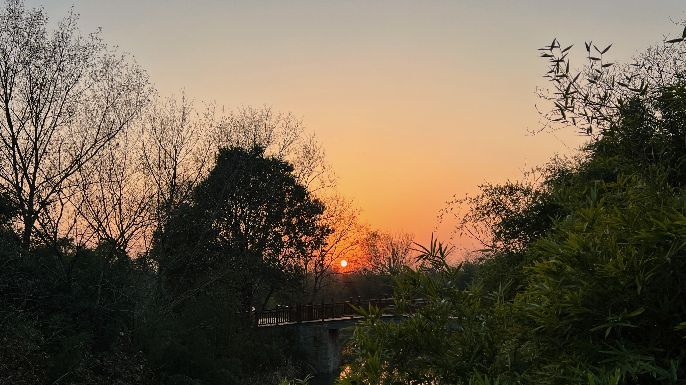

## 2022年度最佳体验

2022年度的最佳体验，包括APP、书籍、电影、Tweets。

- [Obsidian](https://obsidian.md/) (App) - 将笔记从notion迁移至Obsidian，使用Markdown来写日志和笔记，通过ICloud实现PC、MAC和IPhone的三端之间的同步。Obsidian支持双联笔记，将Markdown笔记存储在本地，在公司内网不支持访问外网的情况，是notion的完美替代。
- **悉达多**（赫尔曼·黑塞）- 讲述了悉达多从沙门到世俗，和佛陀的世俗到沙门恰好相反，但是殊途同归，「未经我体验的道理，只是我的衣服而非我的血肉」。
- **最好的告别**（阿图）- 「“岁月累计”——人类学家描述年龄谎报情况，过去人们渴望老年人的殊荣，老年人拥有智慧和知识的掌握。但是现在高龄不再有稀缺价值。」
- **ChatGPT** - [OpenAI](https://openai.com/)提供的智能聊天机器人系统，根据和你的聊天返回结果，比如写段产品测评报告，几乎可以和人工写得报告媲美。缺点是中国区没法使用，并且网络太过拥堵，体验不好。据称微软已经投资入股，未来的windows会集成OpenAI的服务，可以期待一下。
- **中国是部金融史**（陈雨露）- 作者从金融的视角重新审视了中国历史，从原来的帝王将相切换到更加理性的金融货币的视角，讲述了文明盛衰的密码，挺有意思。
- **共产党宣言**（Marx）- 现在政治和哲学的讨论被有意无意的竖之高阁，把马克思哲学当作圣贤书来对待，重新阅读Marx的著作，现在看还挺有意义。
- **上海2022疫情所感** - 「要了解一个城市, 比较方便的途经不外乎打听那里的人们怎么干活, 怎么相爱, 又怎么死去」（鼠疫-加缪）

## 2022年度的遗憾

2022年的遗憾，包括个人学习和工作：

- 锻炼的中断，导致减肥失败
- 学车未能按计划执行
- 搭建产品的计划未能执行
- 博客未能按计划输出
- 工作上未能更近一步

## 2023年阅读和学习清单

2023年想要阅读的书籍和学习的内容：

- 荒原狼（赫尔曼·黑塞）
- 叔本华的哲学
- 中医学研究(伤寒杂病论、黄帝内经)
- serverless
- python AI environment set
- 前端基础的学习，React、Vue
- 函数式编程

## 2023年想要做的事

2023年想要做的事：

- 锻炼计划和减肥目标：目标减肥至82KG，每日锻炼+节食计划
- 个人知识的搭建和输出：金融领域、产品领域
- 个人理财：股票知识的学习和练手
- 练车事项：目标4月前完成
- 个人博客的搭建：按周输出文章
- 搭建Java Web脚手架和小程序