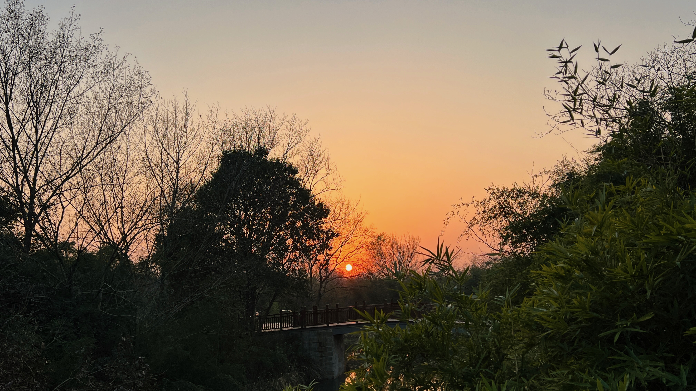

## Best of 2022

Highlights of 2022 — including apps, books, movies, and tweets.

- [Obsidian](https://obsidian.md/) (App) — Migrated my notes from Notion to Obsidian. I use Markdown for journals and notes, syncing across PC, Mac, and iPhone via iCloud. Obsidian supports bidirectional linking and stores Markdown notes locally — a perfect Notion alternative when the company intranet can't access the internet.
- **Siddhartha** (Hermann Hesse) — Siddhartha's journey from ascetic to worldly man is the opposite of the Buddha's path from prince to sage, yet both arrive at the same destination. "Wisdom cannot be imparted. Wisdom that a wise man tries to impart always sounds like foolishness."
- **Being Mortal** (Atul Gawande) — "Accumulating years" — anthropologists' term for age inflation. In the past, people craved the prestige of old age; elders held wisdom and knowledge. Today, advanced age no longer carries that稀缺价值.
- **ChatGPT** — An intelligent chatbot from [OpenAI](https://openai.com/) that generates responses based on conversation. It can write product evaluation reports nearly indistinguishable from human-written ones. Downsides: inaccessible in China, and the network is too congested for a good experience. Microsoft has reportedly invested and will integrate OpenAI's services into Windows — something to look forward to.
- **China is a Financial History** (Chen Yulu) — The author reexamines Chinese history through a financial lens, shifting from the traditional emperor-and-generals perspective to a more rational monetary one, revealing the密码 behind the rise and fall of civilizations. Quite fascinating.
- **The Communist Manifesto** (Marx) — Political and philosophical discussions today are often deliberately shelved, with Marxist philosophy treated as scripture. Rereading Marx's original works turns out to be quite meaningful.
- **Reflections on Shanghai's 2022 Lockdown** — "If you want to understand a city, the easiest way is to find out how its people work, how they love, and how they die." (Albert Camus, *The Plague*)

## Regrets of 2022

Things I regret in 2022, including personal learning and work:

- Interrupted exercise routine, leading to failed weight loss goals
- Didn't follow through on driving lessons
- Failed to execute the product-building plan
- Blog output didn't meet the plan
- Didn't make further progress at work

## 2023 Reading and Learning List

Books and topics I want to explore in 2023:

- *Steppenwolf* (Hermann Hesse)
- Schopenhauer's philosophy
- Traditional Chinese medicine (*Treatise on Cold Damage Disorders*, *Yellow Emperor's Inner Canon*)
- Serverless
- Python AI environment setup
- Frontend fundamentals — React, Vue
- Functional programming

## Goals for 2023

Things I want to accomplish in 2023:

- Exercise plan and weight loss target: lose weight to 82 kg with daily exercise and diet
- Build and share personal knowledge: finance, product management
- Personal finance: learn stock investing and practice
- Driving: aim to complete by April
- Personal blog: publish weekly articles
- Build a Java web scaffold and mini-program
